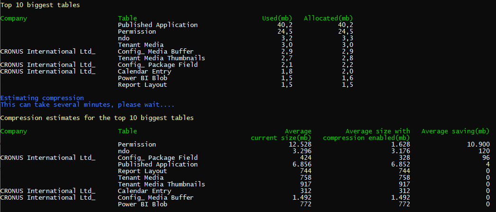

# Data compression in SQL
Data compression at the database level has been avialable in SQL for a while.
As of Business Central April 2019, the use of SQL Server data compression is a supported configuration. You can find documentation about this feature [here](https://docs.microsoft.com/en-us/business-applications-release-notes/april19/dynamics365-business-central/sql-compression )

When enabling compression, you trade storage with compute and you would of course expect that there is price to pay on performance. While this is generally true, it largely depends on how the database is used and as it turned out, for Business Central, the cost of enabling compression is practically negligeable for most scenarios making SQL compression a great way to save storage.

If you want to experiment and see the effect on compression on an on-prem database, you will find a series of utilies and scripts in this repository.

## Compression utilities

### Scripts
----------

The script folder contains some SQL scripts, which can be loaded in Microsoft SQL Management Studion and executed against a mounted database.

#### To10BiggestTable.sql
This script displays the name of the 10 largest tables.
On the first line with the **USE** statement, insert the name of the database, for which you want to get the name of the 10 largest tables.
You can easily tweak this script to get the results for more or less tables.
Running this script does not alter the database.

#### EnableCompressionOnAllTables.sql
This script enables compression on all tables and shrinks the database to reclaim the storage space freed up by the compression.  
On the first line with the **USE** statement, insert the name of the database, for which you want to enable compression.  
Beware that this script does alter the database.

#### Create_sp_MSforeachtable.sql
The scripts above call the **sp_MSforeachtable** stored procedure. Although you can use these scripts on a SQL Azure database, this particular stored procedure does not exist by default on Azure. You can easily create it by running this script.

### BCCompressionCli
-------------------
This utility is a console application written in C#, which displays the size of the biggest tables and shows estimates of the size reduction when compression is enabled for those tables.

Usage:
BCCompressionCli \<databasename\> [\<nbOfTables\>] [\<serverName\>]  
\<databaseName\>: The name of the database to perform compression estimation on.  
\<nbOfTables\>: Optional parameter. By default information for the top 10 tables are shown.  
\<serverName\>: Optional parameter. The name of the SQL server on which the database is mounted.   
If not provided, the server is assumed to be running on the local machine.  

Below is an example of the output

